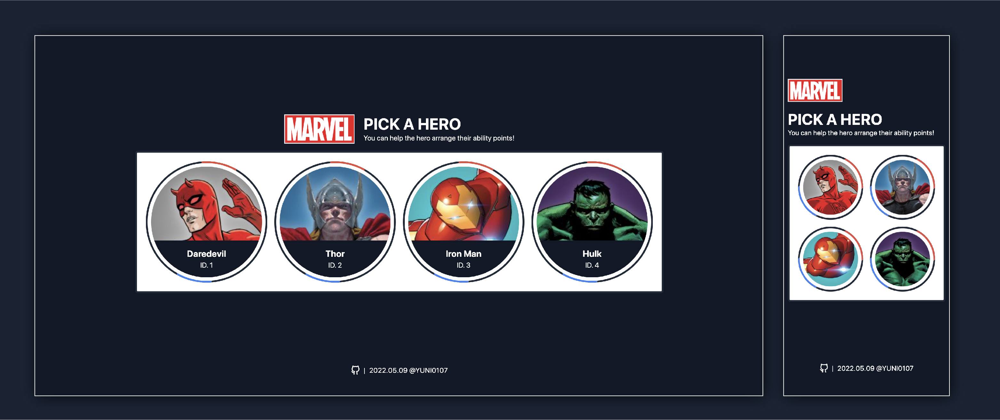
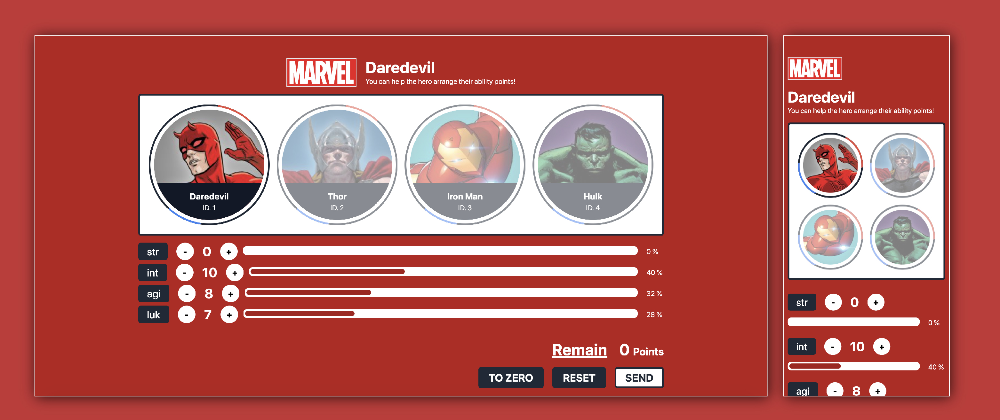

# Hero Cards Page



[⭐️ Github-page Link](https://yuni0107.github.io/react-hero-card-page/)

## 如何執行？

本專案使用 yarn 作為套件管理工具，node 版本為 v16.13.1。

### Project setup，安裝 node_modules

```
yarn
```

### Compiles and hot-reloads for development

```
yarn start
```

### Compiles and minifies for production

```
yarn build
```

## Pages Preview



### Hero profile

調整英雄能力值，並可以觀看能力分配列表。
提供三個按鈕，可以將數值歸零、回歸原本數值與送出新數值。


### Others

1. 如果找不到頁面，導向 Not Found 頁
2. 如果在英雄列表找不到該英雄，導向找不到該英雄的頁面。

## 專案的架構、Web 的架構邏輯

### Basic Part

1. 使用 Webpack 搭起 React + Typescript 專案。
2. 使用 Prettier + Eslint 做 Coding style 規範。
3. 使用 React Router6，使用 Config 檔作為 router 設定，製作 RouterIntercept，將從 `/` root domain 來的使用者導向 `/heroes`。
4. 由於有部署到 github-pages 上，為了使運作正常此專案使用 hash mode，換 url 時不會發送 request。
5. 為了增加擴充性，未來如果 heros 不止四位也可以直接增加。（但如果沒有特別給予主題顏色，會呈現 Default 的黑色。）

### Css Part

1. Tailwind Css + Styled Component，使用 twin.macro 做兩者整合。
2. 在有製作特別動畫，或需撰寫複雜 css 與 js 互動邏輯的地方，會拉出來做成 Styled Component。(規範方式參考了最近覺得有趣的文章： [How to organize styled components in React](https://justeugen.medium.com/best-way-to-organize-styled-components-in-react-with-typescript-fd8625b813d2))
3. 在切版邏輯不複雜的部分，直接使用 Tailwind Css + twin.macro 處理互動邏輯。

### Data Management

1. 使用 Axios 進行 API 呼叫，並引入之前自己撰寫的 custom hook 做 UI State 處理。
2. 使用 Context 做資料的管理與儲存，會把一開始從 `/heroes` 回來的資料直接儲存在 context，考慮不再多叫一次 `/heroes/:heroId` 的原因是兩者的資料並沒有差異，減少去 call api 的成本。

### 程式架構

```
| -- public		    # public folder
| -- src
    | -- assets
            | -- images     # 圖檔資源
    | -- components
            | -- common     # 共用型的components
            | -- layout     # 根據各page製作的的components
    | -- hooks              # custom hooks
    | -- types              # type定義
    | -- mocks              # 切版用的假資料
    | -- pages              # 參考Next，頁面根據router層級整理
    | -- contexts           # 將context邏輯製作成組件
    | -- constants          # 不會變動的 Constant Data
    | -- router             # router 相關
    index.tsx		    # Entry point
    index.css		    # Css Entry
    App.tsx
.babelrc
.eslintrc.json
.prettierrc
.nvmrc
index.d.ts
# 在webpack使用file-loader可以引用檔案，但Typescript無法認得，因此得加入此檔案
tsconfig.json
webpack.config.ts
tailwind.config.js
postcss.config.js
```

## 第三方 Library

### [Axios](https://axios-http.com/)

- 簡介：Promise based HTTP client for the browser and node.js. 官網的這句話其實已經囊括了這個套件的精神。 Axios 是很輕量的套件，它整理 HTTP client 的方法，讓處理 AJAX 過程簡單方便。
- 使用：呼叫 API 的 Custom hook， `useGetResponse` 裡面設定了 BaseURL 等等方法。也基於 Axios˙ 的週期，去自製了 isLoading、isError 等方法。

### [Webpack](https://webpack.js.org/)

- 簡介：Bundle！是 webpack 做的最核心的一件事。將眾多模組與資源打包成一包檔案，並編譯我們需要預先處理的內容，變成瀏覽器看得懂的東西。舉例來說我們用的 import 都不是 JS 原生提供的，webpack 只認得 Common JS，是它幫你把這語法處理過。還可以在裡面做壓縮...等等功能。
- 使用：用 webpack 建置 React 開發環境需要很多設定，需使用 babel-loader、tsconfig-paths-webpack-plugin，讓它認得 React 和 Typescript。style-loader、 css-loader....讓他可以對 Css 進行預處理。file-loader 讓 file 可以引用的方式放進來等等。

### [eslint](https://eslint.org/) 、 [prettier](https://prettier.io/)

- 簡介：這兩個都是拿來規範程式碼，讓你擁有整齊的程式。prettier 和 eslint 都有針對排版的 coding style 進行檢查，所以需要特別設定並免兩者產生衝突。eslint 不只排版還會針對一些常見錯誤或你引用的規範，進行檢查。
- 使用：如果你的 VS Code 有裝 Extension，存檔時直接幫你 Format 相當方便。

### [Tailwindcss](https://tailwindcss.com/)

- 簡介：CSS framework，提供 Utility 讓你可以使用 class name 快速開發。
- 使用：此次專案是結合 twin.macro 做使用，也有使用過 classNames 套件使用過，當滿方便的。此次由於對色彩沒有特別的規範，所以大部分都使用官方原生提供的色彩。

### [styled-components](https://styled-components.com/)

- 簡介：非常老字號的 CSS-in-JS library。它可以傳入 props 值來動態改變樣式。並且在裡面可以寫 Scss。把切版也變成一個一個的 component 管理。（比起 Sass 我比較偏愛 Scss）
- 使用：基本上我覺得如果不是太複雜的需求，Tailwindcss+twin.macro 可以解決掉我 80%的需求，所以在此專案我只有在要製作複雜 Css 動畫時，才會包裝成 styled-components。其實是我沒有很喜歡每個 div 或普通的 h1 都要包成 component，所以才沒有廣用。

### [twin.macro](https://github.com/ben-rogerson/twin.macro)

- 簡介：Twin blends the magic of Tailwind with the flexibility of css-in-js. 它讓你可以把 Tailwindcss 變得可以使用成 css-in-js. 並且還可以結合 styled-components / emotion 做使用。 PS.作者很認真在維護，有問題你都會看到他回答。但文件真的是沒寫很好...，你要從 issues 找問題比較快。
- 使用：最常使用的是直接 css attribute + JS 的控制，決定 twStyle 是否顯示。 在 Webpack 設定上極其麻煩，我這次是第一次在自己建置的上使用 twin.macro 就踩到不少坑。需要安裝很多不同的 babel-plugin，才能成功 Run 起來。

### [react-router-dom](https://reactrouter.com/)

- 簡介：一樣老字號的 router library，近期多了不少競爭對手。可以讓你針對 Router 簡單經鬆進行控制，提供了不少 API 方法給你使用。
- 使用：近一年升級到 V6，多了跟 vue-router 很相似的 config 檔幫法，我自己認為大大提升了整個 router 架構的易讀性，本專案也是使用此方式。

### [react-spring](https://react-spring.io/)

- 簡介：輕量的 animation library，spring 是彈簧，他提供的動畫的曲線函式、動畫的時間相當符合現實物件物品的律動方式，可以給使用者很好的動態體驗。
- 使用：觀望很久，此次是第一次使用。此專案只使用在 HeroList 需要接連出現動畫的地方和 Loading Animation 而已。

## 程式碼中寫註解的原則，遇到什麼狀況會寫註解

我習慣會將每個塊程式碼做整理，上面都加上他所屬的分類。在遇到我認為邏輯複雜，我自己都有可能在回頭看時，會覺得閱讀困難的地方，就必定會寫上註解。如果是第一次實作的功能或遇到困難點但解決的地方，我會把參考文章也附在上面。

## 在這份專案中你遇到的困難、問題，以及解決的方法

除了上述提到第一次在用 twin.macro 在不是 CRA 的環境上，
我花了不少時間去尋找官方 example 跟設定 babel。
在這個專案遇到比較困難的是資料放置位置的問題：

困難與問題：思考有沒有需要使用到 Context 去存取回來的 hero 資料，因為這份資料算是貫穿整個小專案的核心，通常這樣的核心為了避免 props 一層又一層的深入傳下去，我會選擇用 Context 跟 Redux 管理，但此次專案的 component 層數又不算太多。

結論：最後思考了，為了未來可能的需求跟 components 可能會日益複雜，還是決定將它拉到了 Context 層。使用 params 去判斷需要找的英雄是哪一位，可以去跟 Context 的 heroList 去做比較，就可以知道是否有這位英雄的資訊。並且從 Context 層去控制整個 Theme 目前的樣式。
